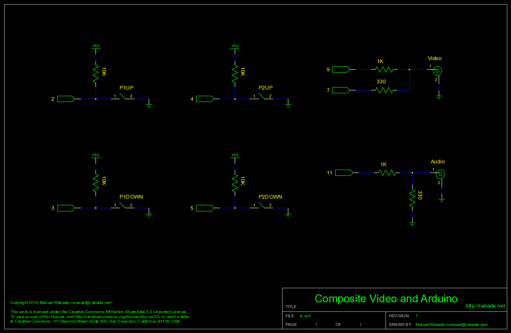

Vídeo compuesto y Arduino
=========================

Ejemplos para generar vídeo compuesto (NTSC, blanco y negro) y audio
por software en un [Arduino](http://arduino.cc) utilizando la
biblioteca [TVout](http://code.google.com/p/arduino-tvout/).

Este proyecto es parte de la platica [Vídeo compuesto y
Arduino](https://speakerdeck.com/manuelrabade/video-compuesto-y-arduino)
presentada en el [Hackmitin](http://hackmitin.espora.org) 2010.

Hardware
--------



Firmware
--------

Para Arduino 0021:

[lib/TVout/](lib/TVout/) - Biblioteca TVout versión R6 (Junio 2010).

[sketch/TVdemo/](sketch/TVdemo/) - Demuestra las funciones de la
biblioteca TVout para generar vídeo y audio. Puedes ver el [video de
TVdemo en funcionamiento](https://vimeo.com/16648861).

[sketch/TVpong/](sketch/TVpong/) - El videojuego clásico de Pong
derivado de un ejemplo distribuido con la [Video Game
Shield](http://wayneandlayne.com/projects/video-game-shield/). Las
modificaciones eliminan la dependencia con la biblioteca
VideoGameHelper y permiten utilizar botones pulsadores en lugar de
controles Wii Nunchuck. Puedes ver el [video de TVpong en
funcionamiento](https://vimeo.com/16648861).

Utilerías
---------

[util/bmp2hex](bin/bmp2hex) - Codifica mapas de bits tipo BMP en
cabeceras de C/C++ para la biblioteca TVout, por ejemplo:

```
$ ./bmp2hex arduino.bmp > arduino.h
```

Autor
-----

Manuel Rábade <[manuel@rabade.net](mailto:manuel@rabade.net)>

Licencia
--------

Esta obra está bajo una [licencia de Creative Commons
Reconocimiento-CompartirIgual 4.0
Internacional](http://creativecommons.org/licenses/by-sa/4.0/).
